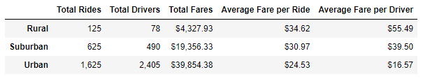

# PyBer_Analysis

## Overview of the analysis.

The objective of this report is aimed to summarize how the driver and fare data differs by city type and how those differences can be used by decision-makers at PyBer to help improve access to ride-sharing services and determine affordability for underserved neighborhoods.

In addition to the data analysis, we are creating visualizations of rideshare data for PyBer, these graphics will support the report to perform an easy assessment of the large and complex datasets.

## Results

Before we go into detail of the city type reports, we need to understand the differences in ride-sharing data among the different city types.

See below ride-sharing summary DataFrame by city type. We can observe that the urban type has the highest driver and ride concentration of all, however it also was the lowest average fare per driver.

 

The following Bubble Chart showcases the average fare versus the total number of rides with bubble size based on the average number of drivers for each city type: urban, suburban, and rural.

> The x-axis is the number of rides for each city.

> The y-axis is the average fare for each city.

##### - Note that the size of each marker is the average number of drivers in each city.

## Statistical analysis 
To demonstrate the relevance of the data, especially the number of rides for each city. This will help to make decisions about which types of cities need more driver support.

The mean fare price for urban trips is $24.53.
The median fare price for urban trips is $24.64.
The mode fare price for urban trips is ModeResult [22.86], count=[5]

The mean fare price for suburban trips is $30.97.
The median fare price for suburban trips is $30.75.
The mode fare price for suburban trips is ModeResult [17.99], count=[3].

The mean fare price for rural trips is $34.62.
The median fare price for rural trips is $37.05.
The mode fare price for rural trips is ModeResult [37.05], count=[2].

## Box-and-whisker plots that visualize and determine if there are any outliers:

#### The total number of rides for each city type.
There is one outlier in the urban ride count data, which is close to 40. This our maximum data point, 39. Also, the average number of rides in the rural cities is about 4- and 3.5-times lower per city than the urban and suburban cities, respectively. 

#### The average fares for each city type.
From the combined box-and-whisker plots, we see that there are no outliers. However, the average fare for rides in the rural cities is about $11 and $5 more per ride than the urban and suburban cities, respectively.

#### The total number of drivers for each city type.
The average number of drivers in rural cities is nine to four times less per city than in urban and suburban cities, respectively.

## Pie charts to visualizes percentages for fares, rides & drivers for each city type.

### The percent of total fares.
The following chart depicts that 62.7% of the total fares are collected on the Urban areas.

### The percent of total rides.
Likewise in proportion, the percent of total rides are made in the urban areas.

### The percent of total drivers.
Following the same trend, urban areas are covering the largest percent of rides, thus requiring the largest percent of driver concentration up to 80.9%

## Summary
From the data we observe that most of the fares are collected from the urban areas, but most likely the capital and operational expenses are also higher, thus total revenue might not be that great.
The average fare for rides in the rural cities is about $11 and $5 more per ride than the urban and suburban cities, respectively. In theory, it seems that increasing the number of drivers in the rural areas makes sense, however there are multiple factors that have not been taken into account to make a correct assessment, some of this factors are:

- Ride demand and waiting times across city types.
- Ride length and duration, rural trips are expected to cover longer distances due to the nature of the geographics.
- Waiting times.
- Operational expenses.
- Consumables, such as maintenance, fuel, spare parts, etc.

Also, note the peak of rides on March, this peak happens in all city types. PyBer should plan ahead and prepare ahead, speacially if this a yearly trend.

Basically, we can deliver an enhanced report if we get access to complementary information and we will be happy to collaborate further with PyBer to accomplish your goals.

